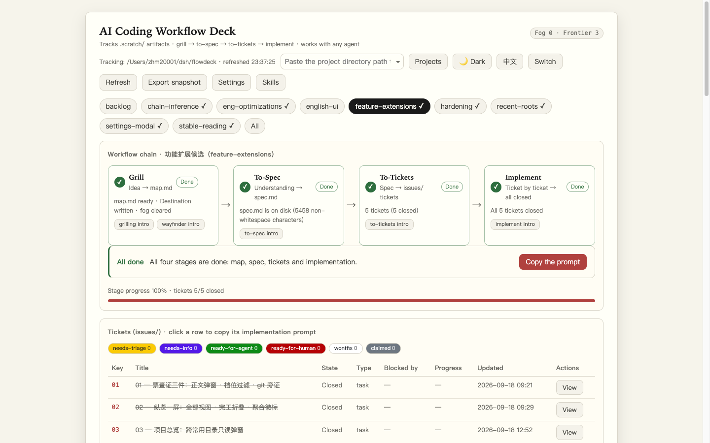
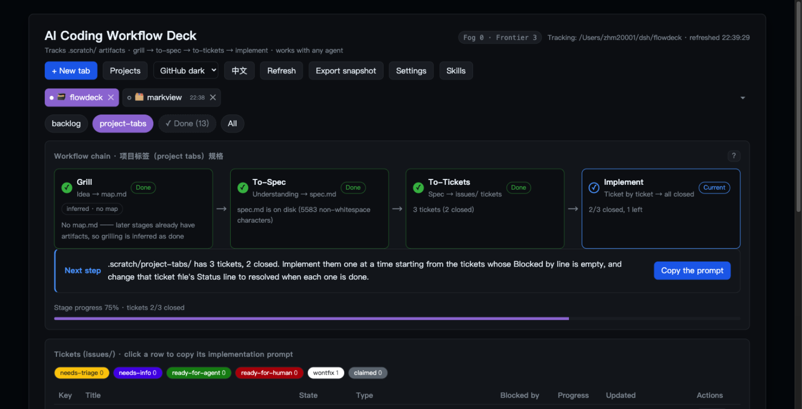
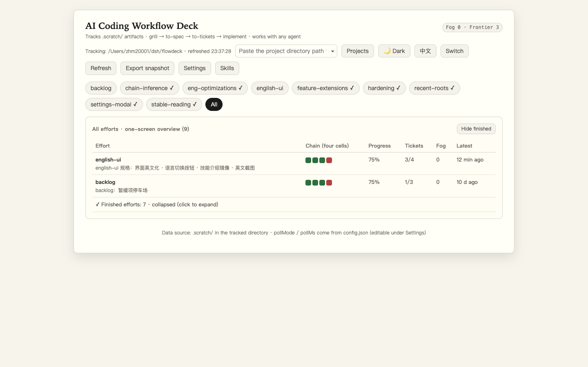

# Matt Skills Flowdeck — a local web dashboard for AI coding workflows, in any project

English · [简体中文](README.zh-CN.md)

## What is this

**Matt Skills Flowdeck** (shortened to **flowdeck** below) is an **unofficial visual board for [Matt Pocock's skills](https://github.com/mattpocock/skills)** — the `grill → to-spec → to-tickets → implement` workflow for AI coding agents. Run those skills and flowdeck keeps watching the `.scratch/` artifacts they produce: which of the four stages each piece of work is in, the next-step prompt for the current stage, and every ticket's status, type, blockers and progress — all in one local web dashboard.

Not using mattpocock/skills yet? Start there — without those artifacts, this board has nothing to track.

Technically it's a **zero-dependency** local Node service (Node built-ins only) plus a single-page browser UI — a tracker that binds itself to no editor and no plugin.

- **Self-contained**: copy the whole directory anywhere (into a target project, onto another machine) and it runs — nothing else needed. Which directory to track lives in `config.json` and can be switched from the web UI at any time.
- **Agent-agnostic**: Claude Code, Cursor, or files you write by hand — flowdeck tracks passively. Any agent that follows the file conventions below and writes into `.scratch/` shows up in the browser:

  - where each of the four stages stands (done / current / waiting);
  - a "next step" prompt for the current stage — one click copies it, paste it into any agent to continue; next to it, shortcuts open the matching skill write-up (grilling / wayfinder / to-spec / to-tickets / implement);
  - every ticket's status, type, blockers and progress; clicking a row copies that ticket's implementation guidance, and "view" opens the full ticket text (Comments included) in a modal;
  - "Export snapshot" in the top bar drops the latest inventory as a timestamped JSON file (an archive to keep or to feed another agent) — it is an **inventory archive**, not a full backup: ticket bodies are lazy-loaded and not included;
  - opt-in desktop notifications (off by default): ticket closed, fog count changed, stage advanced — with backlogged changes aggregated into one notice when you return; keep it running in the background and still know what moved.

The UI is bilingual — Chinese by default, and the top-bar button switches the whole board to English (the choice is remembered per browser; a browser that prefers English starts in English). The skill catalog ships in both languages too. The parts of tracked files that matter for the rules (`## Destination` headings, `Status:` values) are English already, and artifact bodies in any language don't affect the verdicts.

The board **scales with the viewport**: on a wide screen the type size, the spacing and the main container open up together (width capped at `1600px` to keep line length readable), while a small screen sits back at the pre-refactor sizes. To set the overall size deliberately, the settings modal has an **Appearance** section with a **UI scale** step — small / medium / large / extra-large, medium being the pre-refactor default. Three peer themes — cold white (the default), warm paper, GitHub dark — are picked from the top bar. Theme and scale are browser-local preferences, never written to `config.json`.

## Screenshots

All three are the English UI, running against this repository's own `.scratch/`.

Main view (light, paper theme) — the four-stage chain, the next-step prompt card, and the ticket table:



| Dark theme | All-efforts overview |
|---|---|
|  |  |

Ticket titles inside the shots are still Chinese: those are the tracked artifacts' own text, which the board displays verbatim in any language.

## Quick start

```bash
git clone https://github.com/zhm20001/matt-skills-flowdeck.git flowdeck   # or skip git: copy the directory into your project
cd flowdeck
cp config.example.json config.json   # optional: pre-configure from the template (runs fine without one, see below)
npm start                            # or: node server.mjs
```

Open the printed address (default `http://127.0.0.1:3210`). The server listens on the loopback interface only. Writes are guarded twice: POST endpoints require a custom `X-FlowDeck` header (other pages in your browser can't send it, which blocks cross-site writes), and while on loopback the server also validates the request's `Host` header — only `127.0.0.1` / `localhost` / `[::1]` pass. Without that check, a malicious page could DNS-rebind its domain to 127.0.0.1, become same-origin, and use the custom header freely to switch the tracked root or read arbitrary `.scratch` content. For LAN access set `host` in config.json (e.g. `0.0.0.0`): Host validation then relaxes, and every machine on the LAN can browse, switch roots, and read tracked content — set a `token` too (next section) to gate `/api/*` with a shared token.

The tracked root doesn't have to be pinned: pass `--root /path/to/project` at startup, or paste a path into the top-bar input and hit "switch" after startup — it takes effect immediately and is written back to config.json, so you won't need to enter it again.

Roots you successfully switch to enter the recent-roots list (kept in config.json's `recentRoots`, most recent first): click the input or its ▾ to expand the dropdown and jump back with one click; type to filter by full path, navigate with ↑↓/Enter, and remove an entry with its ✕. The list travels with config.json across browsers and machines.

## config.json (root and friends)

Two ways to start: `cp config.example.json config.json` and edit (the template has the same structure and field notes, all values safe defaults) — or **don't create the file at all**: the server tolerates its absence and defaults everything (root = working directory at startup, port 3210, host 127.0.0.1, pollMs 5000, recentRoots empty, token empty); it gets auto-created on your first root switch from the UI.

Two ways to edit, too: by hand, or via the **settings modal** in the top-right corner (root / recentRoots excepted — they have dedicated interactions in the top bar). pollMs and the access token take effect on save (the server re-reads each poll; tokens hot-swap); host / port apply after a restart (the toast tells them apart). Both paths write the same file — there is never a second source of truth.

config.json is git-ignored (`.gitignore`): the server rewrites it at runtime, so tracking it would leave the work tree permanently dirty and leak local absolute paths through diffs. Only the template `config.example.json` is committed.

```json
{
  "root": "",            // project directory to track (must contain .scratch/). Empty = current directory at startup
  "recentRoots": [],     // recent roots: auto-recorded on switch (most recent first, cap 50); editable by hand
  "port": 3210,          // web port; falls forward through 10 ports if taken; restart to apply
  "host": "127.0.0.1",   // listen address
  "pollMs": 5000,        // UI poll interval in ms; keep it >= 1000
  "token": ""            // access token: non-empty = every /api/* call must carry it; for 0.0.0.0 LAN exposure
}
```

- The file also carries a "说明" ("notes") key and a "字段说明" ("field notes") key — human-readable comments standing in for JSON's lack of them; edit or delete freely, they don't affect behavior;
- `root` should be an **absolute path**; relative paths resolve against the directory holding config.json; a leading `~/` expands to your home directory;
- `recentRoots` entries are normalized absolute paths; hand-written `~/` and relative entries normalize on load, and one directory counts once; temporary `--root` startups are not recorded;
- CLI flags (`--root/--port/--host/--config/--token`) take precedence over config.json;
- **Access token**: empty = disabled (the default; loopback use doesn't need it). Set it to a non-empty string and every `/api/*` request (inventory, root switch, recent-roots deletion, config changes) must carry it — as an `X-FlowDeck-Token` header or a `?token=` query value, compared in constant time. Open the page with `?token=yourtoken` in the URL once: the UI remembers it (localStorage), attaches it to every request afterwards, and scrubs it from the address bar. The static shell (HTML/CSS) is not gated — data lives only under `/api/*`. Changing the token in the settings modal is **immediate** (tokens are write-only: never echoed back; the UI switches over on save); editing the file by hand still needs a restart;
- Switching roots, deleting recent roots, or changing settings from the UI all write back to this file — hand edits and UI edits are always the same truth.

## The skills catalog (docs/skill-intros/)

The **"skills" button** in the top-right corner opens a static showcase: the 35 skills of Matt Pocock's skill pack, grouped by category, each with what it is, when to use it, how to trigger it, and the original description quoted at the end. The material is hand-written Markdown in the repo — one file per skill under `docs/skill-intros/`, with `docs/skill-intros/README.md` as the overview. The server exposes `GET /api/skills` (the catalog, read from each file's frontmatter, sorted by category) and `GET /api/skills/<name>` (the full text); the UI's built-in mini renderer displays it, and edits show up on refresh. The skill sources themselves are not in this repo — only these write-ups.

In the English UI both endpoints take `?lang=en` and read a same-named mirror under `docs/skill-intros-en/` (36 files, one per Chinese doc). The Chinese directory stays the single source of the catalog — which docs exist, their category, order and in-progress mark — and the mirror only supplies the title, the one-liner and the body; a doc missing its mirror keeps its Chinese text, the response self-reports the language it actually served in the `X-FlowDeck-Doc-Lang` header, and the UI labels it "no English version yet" based on that header. Without `lang` (or with any value but `en`) both endpoints answer with exactly the same body as they always did — that byte-for-byte red line covers success bodies; JSON error responses additionally carry the stable `code` field (intentional, so the UI can word errors by it).

## What it reads (the `.scratch/` artifact conventions)

One effort (one piece of work) = a `.scratch/<feature>/` directory holding one or more of three artifact kinds:

| Artifact | Path | Notes |
|---|---|---|
| Map | `.scratch/<feature>/map.md` | output of grilling / wayfinder; `## Destination` is the goal, `## Not yet specified` holds the "fog" (open questions) |
| Spec | `.scratch/<feature>/spec.md` | output of to-spec; rendered and tracked by flowdeck |
| Ticket | `.scratch/<feature>/issues/<NN>-<slug>.md` | output of to-tickets; one ticket per file |

Tickets use inline field lines (not YAML frontmatter). **Bold or bare, both legal, same semantics** (the to-tickets template emits bold; the plugin's writer and the conventions doc emit bare):

```markdown
# Ticket title
**Status:** ready-for-agent  # resolved / completed / closed / done all count as closed; claimed = in progress
Type: task                   # research / prototype / grilling / task
**Blocked by:** #02, #03     # tickets this one depends on

## 进度：50%
```

Lines that look like field lines but don't parse (e.g. `*Status:* done`, field lines inside list items), or conflicting multiple Status lines, get a "!" badge next to the ticket title (hover for the raw text) — a drift warning, not an invalidation.

A `.scratch/` root that directly contains `map.md` / `spec.md` / `issues/` counts as an effort too (shown as "root .scratch/" in the UI).

## Chain rules (how "where are we" is decided)

All four stages derive from **file facts**; there is no hidden state — every refresh is a fresh inventory of the disk:

| Stage | Done when | Next-step prompt shown while current |
|---|---|---|
| Grill | map.md exists, Destination non-empty, zero fog; or any later stage already has artifacts (inferred done, marked "inferred · no map") | run grilling / wayfinder; or keep grilling until the fog clears |
| To-Spec | spec.md exists with content; existing tickets also infer it done (marked "inferred · no spec") | run to-spec, distill the understanding into spec.md |
| To-Tickets | at least one valid ticket under issues/ | run to-tickets, split the spec into tickets |
| Implement | at least one ticket, and all of them closed | implement ticket by ticket starting from ones with an empty Blocked by; set Status to resolved as you finish each |

The first unfinished stage is the "current step"; all four green = 100%.

Done can be **inferred from downstream**: the stages are sequential, so later artifacts mean the earlier road was walked — even without the standard artifact of that stage. grill-with-docs files its conclusions into CONTEXT.md / ADR instead of map.md; such an effort's Grill cell is inferred done from spec.md and later artifacts, marked "inferred · no map" to stay distinct from evidenced completion. Inference and evidence carry the same weight on the chain (current step moves on, progress counts); with no downstream artifacts at all, the early behavior is unchanged (fog still gates Grill).

## Pointing any agent at it

flowdeck only reads files, so onboarding an agent means having it follow the artifact conventions above. When no artifacts exist yet, the page offers two one-click copyable starters: "工作约定" (working conventions — paste into any agent's system prompt or the top of a conversation) and "建骨架指令" (scaffold instruction — has the agent create `.scratch/<feature>/map.md` with Destination and Not yet specified sections, starting the first effort). English version of the conventions:

```text
This project's AI coding workflow follows the .scratch artifact conventions — comply strictly:
1. Grilling: write conclusions to .scratch/<feature>/map.md, which must contain a "## Destination"
   section; anything not yet decided goes under "## Not yet specified".
2. Spec (to-spec): distill the discussion into .scratch/<feature>/spec.md.
3. Tickets (to-tickets): one file per ticket at .scratch/<feature>/issues/<NN>-<slug>.md, body
   carrying inline fields "Status:" (ready-for-agent / claimed / resolved), "Type:", "Blocked by: #NN".
4. Implementation: work the tickets one by one; as each ticket finishes, change its Status line to resolved.
```

## Verification

```bash
npm run verify    # equivalent alias: npm test
npm run lint      # minimal static checks (ESLint, real-bug drift only, no style policing)
```

verify covers: effort discovery; four-scenario chain states (including backward inference and the "inferred · no map" marker); ticket field parsing; bold/bare field-line equivalence and "!" drift warnings; pure-function idempotence (chain derivation, recent-roots MRU transforms); root resolution rules; a single heading rule (map/spec and tickets share the built-in parser); HTTP routing; port-taken fallback; config read/write; the switch-root API's three rejections and hot switching; the settings endpoint's extended fields (per-field validation of pollMs/host/port/token, "applied" semantics, token hot-swap without echo); the `/api/issue` raw-text endpoint (happy path / 404 / token and guards); new inventory fields (raw ticket status; git sidecar present/absent — the positive path uses a temporary git repo fixture, and the group skips itself when git is missing; Labels still not projected); the git sidecar ignoring the fingerprint cache (commits with untouched files still catch up within TTL); frontier semantics for blocked counts (fully-resolved dependencies don't count as blocked; cycles and ghost dependencies both do; open unclaimed = frontier); the roots-overview endpoint (mixed good/bad directories, one bad row doesn't sink the window, GET doesn't touch ordering, empty list single row); Host-header validation (forged Host gets 403, loopback spellings pass); 413 on oversized POST; client-abort resilience; exactly-once bad-config warnings; CLI flag guards; the access token (401 on missing/wrong, header or query both work, writes equally gated, static shell exempt); recent-roots recording/reordering/cap eviction/`--root` exclusion; the delete endpoint's guards and idempotence — plus, with jsdom (a dev dependency; the group skips itself when absent), the page really runs: the recent-roots dropdown (expand, filter, keyboard, pick-to-switch, ✕ delete, coexisting with polling); the token captured from the URL, remembered, and attached; three renderer extensions (tables / fenced code / italics with degradation paths); refresh skipping on unchanged signatures and scroll restoration on real repaints; the spec card's light rendering and the "expand" modal (snapshot semantics, Esc/focus return); the ticket-body modal (lazy load, snapshot semantics, field-line stripping); triage chip filtering (toggle/cancel/poll persistence/keyboard reachability); the git sidecar row rendering and disappearing when absent; the overview screen's two-group sorting and collapse/switch memory in localStorage (write-through and preset reads); badge counts and the frontier panel's jumps; the projects-overview modal (on-demand fetch, bad rows annotated, row click reusing the existing switch flow); the settings modal (initial values, submitting only changed fields, token sync with clear-confirmation); notification-event derivation (unit-level: all four event types as human sentences — including stage fallback and completion edges; no-change / mtime-only / effort-disappeared / root-switch / new-ticket false-positive cases; deterministic order); desktop notifications in jsdom (stubbed Notification: enabling requests permission, denial falls back with a remedy hint, backlog aggregates into one "N changes meanwhile" notice, mtime-only yields zero notifications, timed ticks announce each event, clicking focuses and switches to the effort, manual pings and lazy mode stay silent); snapshot export (filename `flowdeck-snapshot-<project>-<localtime>.json` shape, content byte-identical to the latest /api/state response — not re-serialized, object URL released after use); the scaffold instruction (the empty state's second block: relative map.md path + Destination/Not yet specified + expected inventory change, the two one-click copies not cross-talking); and skill linkage (a stage cell's skill shortcut opens the catalog focused on that skill, an open modal switches skills without refetching, and it doesn't trigger the cell's copy); and the language layer (initial language from the browser's languages with Chinese as the fallback, the toggle repainting in place and remembering in localStorage, the English shell scanned view by view for leftover Chinese, guide words / notifications / error wording all following the language, `?lang=en` on both skill endpoints while param-free responses stay byte-identical, the 36 mirror docs checked line by line against their Chinese originals, and the static shell's four word-lookup channels pinned to actually yield copy — a blanked label can never pass as "no Chinese left"); and the three peer themes (the cold-white default living on the `<html>` markup, the top-bar dropdown landing the right `data-theme` and writing `flowdeck-theme`, the remembered theme surviving a reopen, the legacy "light" preference migrating to cold, three literally-peer token files with aligned semantic slots, and the cold tokens served through the whitelist); and the fluid-scaling base, checked at file level (the `--fluid-base`/`--ui-scale` root font-size wiring, every font-size/padding/margin/gap declaration already converted to rem with zero px left over, and component-fixed sizes — menu width, settings box, root input, chip radius — deliberately still in px; jsdom lays nothing out, so pixel behavior gets measured in a browser rather than asserted here); and the UI-scale step (the four multipliers living only in CSS, pinned to the same value set the Appearance section offers, the anti-flash read ordered before the stylesheet, switching landing the right `data-ui-scale` and writing `flowdeck-ui-scale`, no attribute meaning medium, a remembered tier applied before paint on reopen, and an unrecognised value falling back to medium).

Push-verified: `.github/workflows/ci.yml` runs `npm run lint` + `npm run verify` on Node 18 and 22 for every push and PR.

## File map

| File | Responsibility |
|---|---|
| `config.json` | user config: tracked root, recent roots, port, host, poll interval, access token (plus the human-note fields). Rewritten at runtime, git-ignored — local paths never leak through diffs |
| `config.example.json` | the committed template: same structure, all-safe defaults, no local paths |
| `flowchain.mjs` | chain derivation (pure, zero-dep; stage definitions hard-code their matching skill names for the prompt cards; independently portable — no callers need to change) |
| `notify.mjs` | inventory-event derivation (pure; only imports flowchain.mjs's stage table): a structured diff of two inventory snapshots — ticket open/close, fog count, current stage, new effort — feeding desktop notifications (index.html carries an ES5 mirror; the two comments point at each other) |
| `lib/parse.mjs` | the built-in Markdown structure parser (single-pass; behavior pinned by the verify fixtures) |
| `scan.mjs` | scans the tracked `.scratch/`, producing the inventory (parallel scanning on the hot path; map/spec and tickets share the built-in parser for headings) |
| `server.mjs` | HTTP server + CLI entry (`/`, `/styles/*.css`, `/api/state` (with `recentRoots` and runtime pollMs/host/port/tokenEnabled, the `stageNames` table flowing the four stage titles down in both languages, plus one git sidecar field per effort — latest commit or null, ~15s TTL, not tied to the fingerprint), `/api/health`, `/api/roots-overview`, `/api/issue`, `/api/skills`, `/api/skills/<name>` (both accept `?lang=en`, which reads the same-named mirror under `docs/skill-intros-en/`; without `lang` the response body is byte-for-byte what it always was, and the single-doc endpoint self-reports the served language in `X-FlowDeck-Doc-Lang`), `POST /api/config` (root switch and pollMs/host/port/token changes, per-field validation, token changes immediate), `POST /api/recent-roots`; Host validation first against DNS rebinding, POST endpoints further gated by the X-FlowDeck header against cross-site writes, oversized bodies get 413; a non-empty token gates all of `/api/*`; polling paths fully async) |
| `eslint.config.mjs` | minimal lint config (flat config, real-bug drift only; lib/parse.mjs is exempt — its behavior is pinned by the verify fixtures) |
| `.github/workflows/ci.yml` | CI: lint + verify on Node 18/22 for pushes and PRs |
| `styles/app.css` | all business styles for the UI (extracted from index.html's former inline `<style>`); its leading `--fd-*` alias block is the single consumption layer over the tokens, and business styles carry zero raw values. Also home of the fluid-scaling base: `html { font-size: calc(var(--fluid-base) * var(--ui-scale)) }` with `--fluid-base: clamp(10px, 0.5vw + 4.6px, 11.5px)`, so type size and padding/margin/gap all run in rem on a `1rem = 10px` base while component-fixed widths (menus/modals), radii and borders stay px; the main container's `max-width: clamp(1080px, 92vw, 1600px)` fills wide screens without sacrificing line length, and each modal keeps its own width instead of growing with the container; the four UI-scale multipliers live here and nowhere else (`:root[data-ui-scale="sm"|"md"|"lg"|"xl"] { --ui-scale: … }`, with no attribute meaning medium), so JS only sets a marker attribute on `<html>` |
| `styles/tokens-cold.css` | cold-white theme tokens (**the default**, `data-theme="cold"`): values taken from the paper-palette-lab generated file (re-scoped on the way in), since then flowdeck-owned and edited locally — the external generator header was replaced and slots may be added (`--warn` is one); keeps its own colors (vermilion `#b1413e`, deliberately not aligned to warm paper's `#b0413e`); colors and font stacks live only in tokens files |
| `styles/tokens-paper.css` | warm-paper theme tokens (`data-theme="paper"`): a peer of cold/dark, and flowdeck's own editable copy (diverged from the external generated original) |
| `styles/tokens-github-dark.css` | GitHub-dark theme tokens (`data-theme="dark"`): the same token names in the same order as the two light themes plus dark-only slots; the three are peers — swapping `data-theme` swaps the whole skin with zero business-style edits |
| `index.html` | the browser UI (single file, no build; polls at the config interval, skips repainting when the data signature is unchanged and restores scroll when it does; light spec rendering with an expand-to-modal reader reused for ticket bodies; six-way triage chip filter and the git sidecar row; an "all" overview across efforts (in-progress by recency, done collapsed by default, preferences per browser); fog+frontier badges with a jump panel; a cross-root projects overview; snapshot export; opt-in desktop notifications; empty-state one-click starters; per-stage skill shortcuts; root switching with the recent-roots dropdown; a settings modal for pollMs/host/port/token (plus an Appearance section holding the UI-scale step — small/medium/large/extra-large, applied instantly, browser-local); a top-bar dropdown switching between the three peer themes — cold white (the default, hard-coded on the `<html>` markup), warm paper and GitHub dark — remembered per browser, with the legacy "light" preference migrated to cold; a top-bar 中/英 button switches the whole shell — copy, guide words, notifications, error wording and the skills catalog — with the choice remembered per browser; business styles consume only one layer of `--fd-*` aliases) |
| `docs/skill-intros/` | the skills catalog: one Chinese write-up per skill (frontmatter feeds `/api/skills`), README is the overview; static material for the UI modal, and the single source of the catalog's shape (which docs, category, order) |
| `docs/skill-intros-en/` | English mirror of the catalog: same file names, only title/summary/body translated, served when `/api/skills*` gets `?lang=en` |
| `docs/screenshots/` | Chinese-UI demo screenshots used by README.zh-CN.md (light / dark / all-efforts overview) |
| `docs/screenshots-en/` | English-UI demo screenshots used by this README (same three views, same 1440×900) |
| `verify-standalone.mjs` | the standalone verification script |

## Deliberately out of scope

- **No writes into `.scratch/`**: flowdeck is read-only towards the tracked project (its only write is its own config.json); comments and ticket closures stay with the agent editing files directly;
- **No git history as evidence**: the Implement stage is judged by ticket Status lines only; git appears solely as a display sidecar — the "latest commit" line under each effort card (short hash · relative time · title, ~15s server cache; the whole line disappears when there's no repo, git is unavailable, or the query fails — no error, no placeholder, and no influence on any chain rule);
- **One tracked root per instance**: to follow several projects, run several instances (`--config` gives each its own config; stagger the ports).
