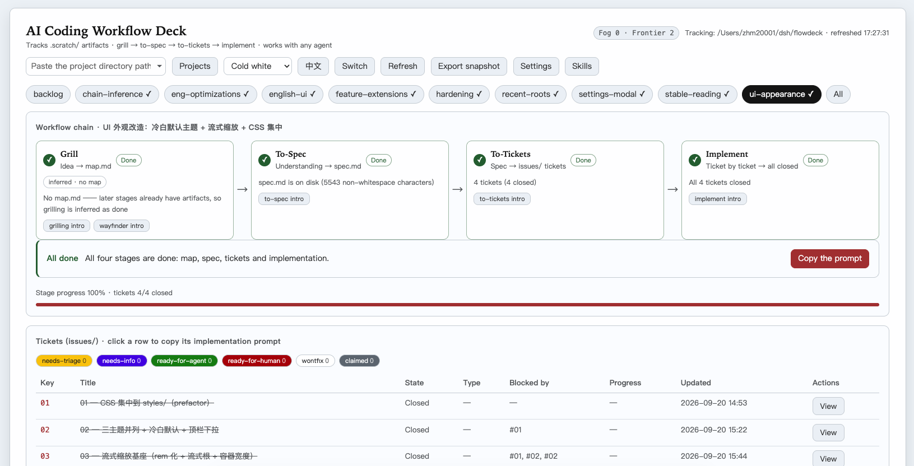
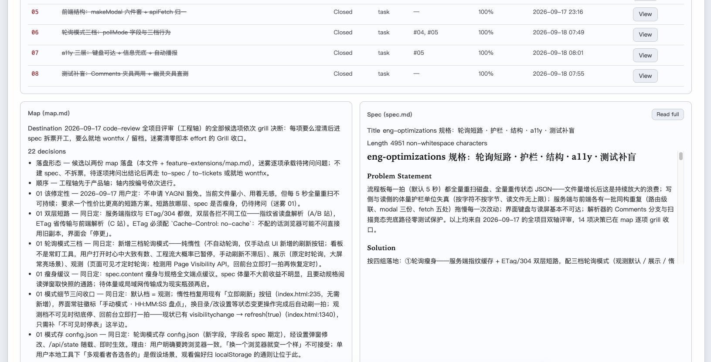

# Matt Skills Flowdeck — a local web dashboard for AI coding workflows, in any project

English · [简体中文](README.zh-CN.md)

## What is this

**Matt Skills Flowdeck** (shortened to **flowdeck** below) is an **unofficial visual board for [Matt Pocock's skills](https://github.com/mattpocock/skills)** — the `grill → to-spec → to-tickets → implement` workflow for AI coding agents. Run those skills and flowdeck keeps watching the `.scratch/` artifacts they produce: which of the four stages each piece of work is in, the next-step prompt for the current stage, and every ticket's status and progress — all in one local web dashboard.

Not using mattpocock/skills yet? Start there — without those artifacts, this board has nothing to track.

Technically it's a **zero-dependency** local Node service (Node built-ins only) plus a single-page browser UI — a tracker that binds itself to no editor and no plugin. The repo is **self-contained**: copy the whole directory anywhere (into a target project, onto another machine) and it runs — nothing else needed. It is **agent-agnostic**: flowdeck tracks passively, so any agent (Claude Code, Cursor, or files you write by hand) that follows the file conventions and writes into `.scratch/` shows up in the browser. Which directory to track lives in `config.json`; the projects you are working on at the same time sit on a **project tab strip** under the top bar, browser-tab style, one click away. A tour of every feature is under [Features](#features).

The UI is bilingual — Chinese by default, and the top-bar button switches the whole board to English.

## Screenshots

All three are the English UI, running against this repository's own `.scratch/` (the Chinese-UI shots live in the [Chinese README](README.zh-CN.md#界面一览), files under `docs/screenshots/`).

Main view, cold-white default theme — the top bar, the project tab strip (flowdeck active, markview suspended with the "last refreshed" time it left at), the effort switch strip with finished efforts folded into "✓ Done (13)", the four-stage chain and the next-step prompt card:



The ticket table (six-way triage chip filter, blockers, progress) with the map and spec cards side by side:



The same board in the GitHub-dark theme — one top-bar dropdown switch, layout untouched:


Ticket and spec titles inside the shots are still Chinese: those are the tracked artifacts' own text, which the board displays verbatim in any language.

## Quick start

```bash
git clone https://github.com/zhm20001/matt-skills-flowdeck.git flowdeck   # or skip git: copy the directory into your project
cd flowdeck
cp config.example.json config.json   # optional: pre-configure from the template (runs fine without one, see below)
npm start                            # or: node src/server.mjs
```

Open the printed address (default `http://127.0.0.1:3210`). The server listens on the loopback interface only. Writes are guarded twice: POST endpoints require a custom `X-FlowDeck` header (other pages in your browser can't send it, which blocks cross-site writes), and while on loopback the server also validates the request's `Host` header — only `127.0.0.1` / `localhost` / `[::1]` pass. Without that check, a malicious page could DNS-rebind its domain to 127.0.0.1, become same-origin, and use the custom header freely to switch the tracked root or read arbitrary `.scratch` content. For LAN access set `host` in config.json (e.g. `0.0.0.0`): Host validation then relaxes, and every machine on the LAN can browse, switch roots, and read tracked content — set a `token` too (next section) to gate `/api/*` with a shared token.

The tracked root doesn't have to be pinned: pass `--root /path/to/project` at startup, or use the top-bar "New tab" button — it takes effect immediately and is written back to config.json, so you won't need to enter it again.

Directories you open as tabs enter the recent-roots list (kept in config.json's `recentRoots`, most recent first): the top-bar "New tab" button opens the dropdown, and picking one opens its card and switches right over; type to filter by full path, navigate with ↑↓/Enter. The list travels with config.json across browsers and machines.

## Features

- **The four-stage chain**: where each of grill → to-spec → to-tickets → implement stands is derived from file facts alone (no hidden state; every refresh is a fresh inventory of the disk), all four green = 100%; the exact rules are under [Chain rules](#chain-rules-how-where-are-we-is-decided);
- **One-click prompts**: the "next step" prompt for the current stage copies on click — paste it into any agent to continue; clicking a ticket row copies that ticket's implementation guidance, and "view" opens the full ticket text (Comments included) in a modal; a small "?" sits at the top-right of the chain card header and opens a guide that strings the four stages to the skills behind them (grilling / wayfinder / to-spec / to-tickets / implement), so "which skills does this stage use" is one read rather than four;
- **Project tab strip**: one card per project you are working on (an auto-derived emoji + the directory name + a status dot), and clicking a card switches to that project; each card remembers its own selected effort, ticket filter and scroll position, so switching away and back lands you exactly where you left off; a **suspended card stops entirely** — zero timers, zero requests, zero desktop notifications, whichever poll mode you picked — and honestly carries the time of the last refresh it actually saw; switching back re-renders that old content first, says so in a light "refresh resumed" toast, then immediately fetches the latest tick; closing every card also stops the manual "Refresh now", and on reload the cards are restored as before;
- **Done folded away**: the effort switch strip lays out only the in-progress efforts; the finished ones (all four stages green) fold into a single "✓ Done (n)" entry that lists them on demand — the one you have selected stays on show and slips back into the fold when you switch away; folding is display-only: not a byte of `.scratch/` moves; an "All" view gives one-screen coverage of every effort;
- **Settings modal**: poll interval / host / port / access token (tokens hot-swap); a **Guidance words** section rewrites the guidance of all five surfaces wholesale and prepends a per-surface prefix (details under the `guides` and `guidesPrefix` fields below — the text lives in config.json, so it travels with the project rather than staying in this browser); an **Appearance** section holds the UI-scale step;
- **Three peer themes + fluid scaling**: cold white (the default), warm paper and GitHub dark, picked from the top bar; the board scales with the viewport (on wide screens type size and spacing open up together, width capped at `1600px` to keep line length readable, while a small screen sits back at the original sizes), and the settings modal has a UI-scale step (small / medium / large / extra-large); theme and scale are browser-local preferences;
- **Desktop notifications + snapshot export**: notifications are opt-in (enabling asks permission) — ticket closed, fog count changed, stage advanced — with backlogged changes aggregated into one notice when you return; "Export snapshot" drops the latest inventory as a timestamped JSON file (an archive to keep or to feed another agent; ticket bodies are lazy-loaded and not included);
- **Bilingual**: the 中/英 button switches the whole shell — copy, guide words, notifications, error wording and the skills catalog; the choice is remembered per browser, and a browser that prefers English starts in English; the parts of tracked files that matter for the rules (`## Destination` headings, `Status:` values) are English already, and artifact bodies in any language don't affect the verdicts.

## config.json (root and friends)

Two ways to start: `cp config.example.json config.json` and edit (the template has the same structure and field notes, all values safe defaults) — or **don't create the file at all**: the server tolerates its absence and defaults everything (root = working directory at startup, port 3210, host 127.0.0.1, pollMs 5000, recentRoots empty, token empty); it gets auto-created on your first root switch from the UI.

Two ways to edit, too: by hand, or via the **settings modal** in the top-right corner (root / recentRoots excepted — they have dedicated interactions in the top bar). pollMs and the access token take effect on save (the server re-reads each poll; tokens hot-swap); host / port apply after a restart (the toast tells them apart). Both paths write the same file — there is never a second source of truth.

config.json is git-ignored (`.gitignore`): the server rewrites it at runtime, so tracking it would leave the work tree permanently dirty and leak local absolute paths through diffs. Only the template `config.example.json` is committed.

```json
{
  "root": "",            // project directory to track (must contain .scratch/). Empty = current directory at startup
  "recentRoots": [],     // recent roots: auto-recorded on switch (most recent first, cap 50); editable by hand
  "port": 3210,          // web port; falls forward through 10 ports if taken; restart to apply
  "host": "127.0.0.1",   // listen address
  "pollMs": 5000,        // UI poll interval in ms; keep it >= 1000
  "token": "",           // access token: non-empty = every /api/* call must carry it; for 0.0.0.0 LAN exposure
  "guides": {},          // guidance-word custom segments: { face: { zh, en } }; {} = all five surfaces use the built-in text
  "guidesPrefix": {}     // guidance-word prefixes: { face: string }; {} = no surface prepends a prefix
}
```

- The file also carries a "说明" ("notes") key and a "字段说明" ("field notes") key — human-readable comments standing in for JSON's lack of them; edit or delete freely, they don't affect behavior;
- `root` should be an **absolute path**; relative paths resolve against the directory holding config.json; a leading `~/` expands to your home directory;
- `recentRoots` entries are normalized absolute paths; hand-written `~/` and relative entries normalize on load, and one directory counts once; temporary `--root` startups are not recorded;
- **Guidance words (`guides`)**: the five surfaces are stored apart — `grill` / `spec` / `tickets` / `implement` are one per stage cell, `ticket` is the ticket-row copy. The shape is `{ face: { zh, en } }`, and a non-empty column **replaces** that surface's built-in text for that language wholesale (it is not prepended); empty or a blank string falls back to the built-in, and each language is judged on its own. A face may be absent and a value may be empty — that *is* "falling back". **Only the `ticket` surface has slots**: `{key}` `{path}` `{title}` are filled in at copy time with the number, path and title of the ticket you clicked; the other four have none, so braces in them are copied out verbatim. An illegal shape (not an object, a key other than `zh`/`en` inside a face, a column that isn't a string) rejects the whole save without writing a single byte. Editing this field by hand takes effect on save, and the settings modal's Guidance words section writes the same one;
- **Guidance-word prefixes (`guidesPrefix`)**: text that is always the same, pasted **in front of** that surface's guidance at copy time with one blank line between (`prefix + blank line + body`) — typically so the first clipboard line is a skill invocation such as `/using-git-worktrees /implement`, which is yours to add rather than something flowdeck should ship as a default. The shape is `{ face: string }`, faces are the same set as `guides`, each stored on its own with no inheritance, and the value is **not split by language** (it is the same words every time, so both interfaces read one value). Empty, a blank string or whitespace all mean "no prefix on this surface", which is the factory state. It is **not** a guidance word: it has no slots (braces are copied out verbatim) and "Restore default" does not touch it (that button clears the custom segment only). Just two exits carry a prefix — the stage cell / next-step button and the ticket-row click (plus "Copy current effect" in the settings modal, which copies exactly what those two would land right now); the wrap-up text, the working agreement and the scaffold instruction never do. An illegal shape (not an object, a face value that isn't a string) rejects the whole save without writing a single byte. Editing this field by hand takes effect on save, and the settings modal's Guidance words section writes the same one;
- CLI flags (`--root/--port/--host/--config/--token`) take precedence over config.json;
- **Access token**: empty = disabled (the default; loopback use doesn't need it). Set it to a non-empty string and every `/api/*` request (inventory, root switch, recent-roots deletion, config changes) must carry it — as an `X-FlowDeck-Token` header or a `?token=` query value, compared in constant time. Open the page with `?token=yourtoken` in the URL once: the UI remembers it (localStorage), attaches it to every request afterwards, and scrubs it from the address bar. The static shell (HTML/CSS) is not gated — data lives only under `/api/*`. Changing the token in the settings modal is **immediate** (tokens are write-only: never echoed back; the UI switches over on save); editing the file by hand still needs a restart;
- Switching roots, deleting recent roots, or changing settings from the UI all write back to this file — hand edits and UI edits are always the same truth.

## The skills catalog (docs/skill-intros/)

The **"skills" button** in the top-right corner opens a static showcase: the 35 skills of Matt Pocock's skill pack, grouped by category, each with what it is, when to use it, how to trigger it, and the original description quoted at the end — plus two aggregate reads that belong to no single skill, the full map and the four-stage tour. The material is hand-written Markdown in the repo — one file per skill under `docs/skill-intros/`, with the aggregate pages alongside. The server exposes `GET /api/skills` (the catalog, read from each file's frontmatter, sorted by category) and `GET /api/skills/<name>` (the full text); the UI's built-in mini renderer displays it, and edits show up on refresh. The skill sources themselves are not in this repo — only these write-ups.

In the English UI both endpoints take `?lang=en` and read a same-named mirror under `docs/skill-intros-en/` (37 files, one per Chinese doc). The Chinese directory stays the single source of the catalog — which docs exist, their category, order and in-progress mark — and the mirror only supplies the title, the one-liner and the body; a doc missing its mirror keeps its Chinese text, the response self-reports the language it actually served in the `X-FlowDeck-Doc-Lang` header, and the UI labels it "no English version yet" based on that header. Without `lang` (or with any value but `en`) both endpoints answer with exactly the same body as they always did — that byte-for-byte red line covers success bodies; JSON error responses additionally carry the stable `code` field (intentional, so the UI can word errors by it).

## What it reads (the `.scratch/` artifact conventions)

One effort (one piece of work) = a `.scratch/<feature>/` directory holding one or more of three artifact kinds:

| Artifact | Path | Notes |
|---|---|---|
| Map | `.scratch/<feature>/map.md` | output of grilling / wayfinder; `## Destination` is the goal, `## Not yet specified` holds the "fog" (open questions) |
| Spec | `.scratch/<feature>/spec.md` | output of to-spec; rendered and tracked by flowdeck |
| Ticket | `.scratch/<feature>/issues/<NN>-<slug>.md` | output of to-tickets; one ticket per file |

Tickets use inline field lines (not YAML frontmatter). **Bold or bare, both legal, same semantics** (the to-tickets template emits bold; the plugin's writer and the conventions doc emit bare):

```markdown
# Ticket title
**Status:** ready-for-agent  # resolved / completed / closed / done all count as closed; claimed = in progress
Type: task                   # research / prototype / grilling / task
**Blocked by:** #02, #03     # tickets this one depends on

## 进度：50%
```

Lines that look like field lines but don't parse (e.g. `*Status:* done`, field lines inside list items), or conflicting multiple Status lines, get a "!" badge next to the ticket title (hover for the raw text) — a drift warning, not an invalidation.

A `.scratch/` root that directly contains `map.md` / `spec.md` / `issues/` counts as an effort too (shown as "root .scratch/" in the UI).

## Chain rules (how "where are we" is decided)

All four stages derive from **file facts**; there is no hidden state — every refresh is a fresh inventory of the disk:

| Stage | Done when | Next-step prompt shown while current |
|---|---|---|
| Grill | map.md exists, Destination non-empty, zero fog; or any later stage already has artifacts (inferred done, marked "inferred · no map") | run grilling / wayfinder; or keep grilling until the fog clears |
| To-Spec | spec.md exists with content; existing tickets also infer it done (marked "inferred · no spec") | run to-spec, distill the understanding into spec.md |
| To-Tickets | at least one valid ticket under issues/ | run to-tickets, split the spec into tickets |
| Implement | at least one ticket, and all of them closed | implement ticket by ticket starting from ones with an empty Blocked by; set Status to resolved as you finish each |

The first unfinished stage is the "current step"; all four green = 100%.

Done can be **inferred from downstream**: the stages are sequential, so later artifacts mean the earlier road was walked — even without the standard artifact of that stage. grill-with-docs files its conclusions into CONTEXT.md / ADR instead of map.md; such an effort's Grill cell is inferred done from spec.md and later artifacts, marked "inferred · no map" to stay distinct from evidenced completion. Inference and evidence carry the same weight on the chain (current step moves on, progress counts); with no downstream artifacts at all, the early behavior is unchanged (fog still gates Grill).

## Pointing any agent at it

flowdeck only reads files, so onboarding an agent means having it follow the artifact conventions above. When no artifacts exist yet, the page offers two one-click copyable starters: "工作约定" (working conventions — paste into any agent's system prompt or the top of a conversation) and "建骨架指令" (scaffold instruction — has the agent create `.scratch/<feature>/map.md` with Destination and Not yet specified sections, starting the first effort). English version of the conventions:

```text
This project's AI coding workflow follows the .scratch artifact conventions — comply strictly:
1. Grilling: write conclusions to .scratch/<feature>/map.md, which must contain a "## Destination"
   section; anything not yet decided goes under "## Not yet specified".
2. Spec (to-spec): distill the discussion into .scratch/<feature>/spec.md.
3. Tickets (to-tickets): one file per ticket at .scratch/<feature>/issues/<NN>-<slug>.md, body
   carrying inline fields "Status:" (ready-for-agent / claimed / resolved), "Type:", "Blocked by: #NN".
4. Implementation: the authoritative text for this step lives in the deck's own working-convention
   block ("工作约定") on the empty state; the README no longer copies it verbatim — that block is the
   source of truth.
```

## Verification

```bash
npm run verify    # equivalent alias: npm test — 115 assertion groups, all green
npm run lint      # minimal static checks (ESLint, real-bug drift only, no style policing)
```

Push-verified: CI (`.github/workflows/ci.yml`) runs both commands on Node 18 and 22 for every push and PR. What each assertion group pins is catalogued in [docs/verify-en.md](docs/verify-en.md) — that file doubles as the repo's regression contract (Chinese version: [docs/verify.md](docs/verify.md)).

## Deliberately out of scope

- **No writes into `.scratch/`**: flowdeck is read-only towards the tracked project (its only write is its own config.json); comments and ticket closures stay with the agent editing files directly;
- **No git history as evidence**: the Implement stage is judged by ticket Status lines only; git appears solely as a display sidecar — the "latest commit" line under each effort card (short hash · relative time · title, ~15s server cache; the whole line disappears when there's no repo, git is unavailable, or the query fails — no error, no placeholder, and no influence on any chain rule);
- **One tracked root per server**: the service tracks a single directory at a time; to watch several projects at once, use the **project tab strip** in the UI (clicking a card switches the root, and a suspended card costs zero timers and zero requests; the tab memory lives in this browser while config.json's `root` always equals the active card's directory); to have several projects **polled simultaneously on their own cadence**, run additional instances (`--config` gives each its own config; stagger the ports).

## More docs

- [docs/file-map-en.md](docs/file-map-en.md): the file map — what every file in the repo is responsible for (Chinese version: [docs/file-map.md](docs/file-map.md));
- [docs/verify-en.md](docs/verify-en.md): the full verification coverage catalogue — what each assertion group pins (Chinese version: [docs/verify.md](docs/verify.md)).
