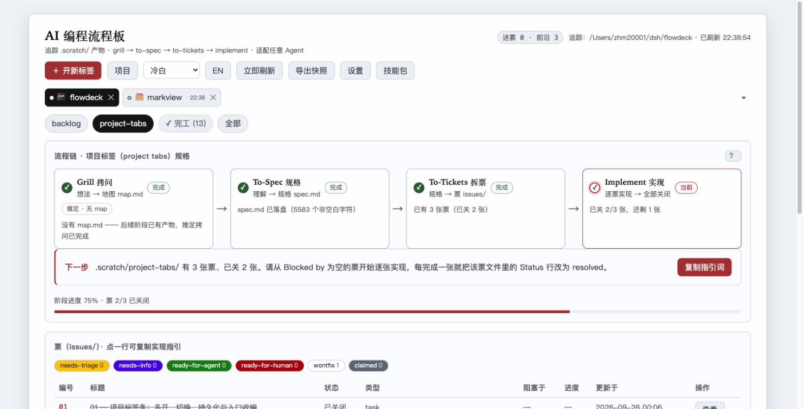
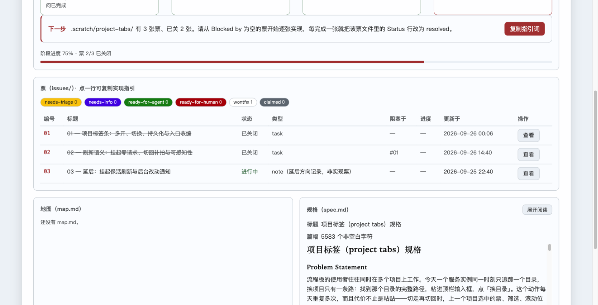

# Matt Skills Flowdeck —— mattpocock/skills 的可视化追踪面板

[English](README.md) · 简体中文

## 这是什么

**Matt Skills Flowdeck**（简称 **flowdeck**，下文同）是 [Matt Pocock 技能包](https://github.com/mattpocock/skills)（`grill → to-spec → to-tickets → implement` 的 AI 编程工作流）的**非官方可视化追踪面板**：只要跑过这套技能，flowdeck 就会持续读取它产出的 `.scratch/` 产物，在一个本地网页上呈现每项工作走到了四阶段中的哪一格、当前阶段的下一步指引词、每张票的状态与进度。

还没用 mattpocock/skills？先从装它开始——没有这些产物，面板无从追踪。

技术上它是一个**零依赖**的本地 Node 服务（只用 Node 内置模块）+ 一个浏览器单页界面，不绑定任何编辑器或插件。**本仓库是自包含的**：整个目录拷到任何地方（拷进目标项目、拷到别的机器都行）就能跑，不需要其他文件。**它对 Agent 没有任何要求**：流程板是被动追踪——任何 Agent（Claude Code、Cursor、或者你自己手写文件都行）只要按约定把产物写进 `.scratch/`，打开浏览器就能看到。追踪哪个目录写在 `config.json` 里；同时在做的几个项目，按浏览器网页标签的方式挂在顶栏下方的**项目标签条**上，一点即到。逐项功能见[主要功能](#主要功能)。

界面默认中文，右上角「中/英」按钮整页切到英文。

## 界面一览

下面是中文态的三张实拍（对 flowdeck 自己的 `.scratch/` 实拍；英文态的三张在[英文 README](README.md#screenshots)，图存 `docs/screenshots-en/`）。

主视图（默认冷白主题）——顶栏、项目标签条（flowdeck 活跃、markview 挂起并摆着离开时的「最近刷新」）、effort 切换条（完工的收进「✓ 完工 (13)」折叠入口）、流程链四格与下一步指引卡：



票表（六档 triage chip 过滤、阻塞于、进度）与并排的地图（map.md）/ 规格（spec.md）卡片：



同一块板换到 GitHub 暗主题——顶栏下拉一换即整体换肤，布局不动：


## 快速开始

```bash
git clone https://github.com/zhm20001/matt-skills-flowdeck.git flowdeck    # 也可以不走 git：直接把整个目录拷进目标项目
cd flowdeck
cp config.example.json config.json # 可选：要预配置就拷一份模板改（不拷也能跑，见下节）
npm start                          # 或者 node src/server.mjs
```

启动后打开终端打印的地址（默认 `http://127.0.0.1:3210`）。服务只监听本机回环地址，不对外网开放。写防护有两层：POST 接口要求自定义 `X-FlowDeck` 头（浏览器里别的网页发不出，挡跨站写）；回环监听时还校验请求的 Host 头，只认 `127.0.0.1` / `localhost` / `[::1]`——不校验的话，恶意页面把它的域名 DNS rebinding 到 127.0.0.1 后请求即同源，自定义头形同虚设，就能改追踪目录、读任意目录的 `.scratch` 内容。想局域网访问改 config.json 的 host（如 `0.0.0.0`）：此时 Host 校验自动放宽，局域网内任何机器都能访问、换目录、读被追踪目录的内容——建议同时设一个 `token`（见下节），给 `/api/*` 加一道共享令牌鉴权。

追踪目录不写死也行：启动时带 `--root /path/to/项目`，或者用网页顶栏的「开新标签」——立即生效并自动写回 config.json，下次启动不用再填。

网页上开过标签的目录会自动进入「常用目录」列表（存在 config.json 的 `recentRoots` 里，最近使用在前）：点顶栏「开新标签」即见下拉，点一条立即为它开卡切过去；输入框按全路径过滤，↑↓/Enter 全键盘操作。换浏览器、换机器拷贝目录，列表都跟着 config.json 走。

## 主要功能

- **流程链四阶段**：grill → to-spec → to-tickets → implement 各走到哪一步全部由文件事实推导（没有隐藏状态，每次刷新都是对磁盘的重新盘点），四格全绿即 100%；判据细节见[流程链规则](#流程链规则可视化怎么判走到哪了)；
- **指引词一键复制**：当前阶段的「下一步」指引词点一下即复制，粘给任意 Agent 就能接着干；点票行复制那张票的实现指引，「查看」弹窗读票全文（含 Comments）；流程链标题行右上角常驻一个小「？」，点开一篇按四阶段串起各自技能（grilling / wayfinder / to-spec / to-tickets / implement）的导读——「哪个阶段背后是什么技能」一篇看完；
- **项目标签条**：每个在做的项目一张卡（自动派生的图形标记 + 目录名 + 状态点），点卡即切过去；每张卡各自记住选中的 effort、票筛选档位与滚动位置，切走再切回还是离开时的样子；**挂起的那张卡完全停下来**——零定时器、零请求、零桌面通知（不管轮询选了哪一档），卡面上诚实摆着离开那一刻的「最近刷新」，切回先见旧内容、弹一条「已恢复刷新」、随即补上最新一拍；把卡全关则连手动「立即刷新」也一并停手，重开页面时标签照旧恢复；
- **完工折叠**：顶部 effort 切换条只平铺进行中的，四格全绿的收进「✓ 完工 (n)」折叠入口、点开才列出（正选中的那个照常平铺，切走才收）；收起只是显示偏好，`.scratch/` 一个字节不动；另有「全部」视图一屏纵览所有 effort；
- **设置弹窗**：轮询间隔 / host / port / 访问令牌（令牌热切换）；「指引词」分区可整段改写五面指引词、并逐面贴一段前缀（详见下文 config.json 的 `guides` 与 `guidesPrefix`，内容跟着项目走而不是留在本浏览器）；「外观」区调界面缩放档；
- **三套平级主题 + 流式缩放**：冷白（默认）/ 暖纸 / GitHub 暗在顶栏下拉切换；界面随视口流式缩放（宽屏字号留白同比舒展、宽度 `1600px` 封顶守行长，小屏落回原尺寸），想整体调大小用设置里的缩放档（小/中/大/特大）；主题与缩放偏好都只记在本浏览器；
- **桌面通知 + 导出快照**：通知默认关，设置里开启即申请权限——票关闭、迷雾增减、阶段推进弹通知，回前台积压聚合成一条；「导出快照」把最近一拍盘点原样落成带时间戳的 JSON 文件（存档或喂给别的 Agent；票正文点开才取，快照不含）；
- **中英双语**：整页切换（文案、指引词、通知、报错措辞与技能包介绍一起翻），选择记在本浏览器，浏览器偏好英文的话首屏就是英文；被追踪文件里起判据作用的部分（`## Destination` 等标题、Status 字段值）本来就是英文，产物正文用什么语言都不影响判定。

## config.json（追踪目录等配置都在这里）

起步两种方式任选：`cp config.example.json config.json` 然后改字段（模板结构与字段说明同款，值全是安全默认）；或者**完全不建这个文件**——服务容忍缺失，全部字段用默认值（root = 启动时当前目录、port 3210、host 127.0.0.1、pollMs 5000、recentRoots 空、token 空），网页上第一次换目录时会自动生成它。

改这些字段有两条路：直接手改文件，或用网页右上角的**「设置」弹窗**（root / recentRoots 除外——它们在顶栏有专门交互）。弹窗里改 pollMs 与访问令牌保存即生效（服务端每拍现读、令牌热切换），host / port 写盘后重启生效（toast 会分开提示）；两边永远是同一个文件，不会有第二真相。

config.json 被 git 忽略（`.gitignore`）：它会被服务在运行时改写，追踪它会让工作树永远不干净、本机绝对路径随 diff 外泄。入库的只有模板 `config.example.json`。

```json
{
  "root": "",            // 要追踪的项目目录（里面得有 .scratch/）。空 = 追踪启动时的当前目录
  "recentRoots": [],     // 常用目录：网页上切换过的目录自动收录（最近使用在前，上限 50）；也可手改
  "port": 3210,          // 网页端口，被占自动往后试 10 个；改完要重启
  "host": "127.0.0.1",   // 监听地址
  "pollMs": 5000,        // 网页轮询间隔毫秒，建议不低于 1000
  "token": "",           // 访问令牌：非空则 /api/* 全部要求携带；0.0.0.0 局域网暴露场景用
  "guides": {},          // 指引词自定义段：{ 面名: { zh, en } }，出厂 {} 即五面全走内置文案
  "guidesPrefix": {}     // 指引词前缀：{ 面名: 字符串 }，出厂 {} 即五面都不贴前缀
}
```

- 文件里另有一个「说明」键和「字段说明」键，是给人看的注释（JSON 不支持注释，就用了这两个字段），改配置时把值改掉即可，删掉也不影响运行；
- `root` 建议写**绝对路径**；写相对路径时按 config.json 所在目录解析；`~/` 开头会自动展开成用户主目录；
- `recentRoots` 里是归一化的绝对路径，`~/` 和相对路径的手写条目读入时自动归一、同一目录只算一条；`--root` 启动的临时目录不收录；
- **指引词（`guides`）**：五面各存各的——`grill` / `spec` / `tickets` / `implement` 是四个阶段格各一面，`ticket` 是点票行复制那面。形状 `{ 面名: { zh, en } }`，某一面的某一列非空就**整段取代**该列的内置文案（不是接在前面），留空或空串即回落内置，中英各判各的。面可以缺、值可以是空串，那正是「回落内置」本身。**只有 `ticket` 那面带槽**：`{key}` `{path}` `{title}` 在复制那一刻实填成被点那张票的票号、路径与标题；其余四面无槽，段里的花括号原样复制出去。写坏的形状（不是对象、面内多了 `zh`/`en` 以外的键、某一列不是字符串）会让整次保存被拒，一个字都不写盘。手改这个字段保存即生效，网页「设置」的「指引词」分区也是同一份；
- **指引词前缀（`guidesPrefix`）**：一段每次都一样的文字，复制那一面时**原样贴在最前面**，中间空一行（`前缀 + 空行 + 正文`）——典型用途是让剪贴板第一行是一条技能调用（`/using-git-worktrees /implement`），而那句话既不属于 flowdeck、也不该成为别人的出厂默认。形状 `{ 面名: 字符串 }`，面名与 `guides` 同一套、每面各存各的、不互相继承；**中英不分列**（装的是斜杠命令这类每次都一样的话，两个语言界面用同一份）。留空 / 空串 / 全空白都等于这一面不贴，出厂即如此。它**不是**一段指引词：没有槽（里面的花括号原样复制出去），也不受「恢复默认」影响（那个按钮只清自定义段）。带前缀的出口有两处——阶段格/下一步卡按钮与票行点击（设置弹窗的「复制当前效果」复制的正是这两处此刻会粘出的那段，所以也带前缀）；完工收尾文案、空态页的工作约定与建骨架指令都不带。写坏的形状（不是对象、某个面的值不是字符串）会让整次保存被拒，一个字都不写盘。手改这个字段保存即生效，网页「设置」的「指引词」分区也是同一份；
- 命令行参数（`--root/--port/--host/--config/--token`）优先级高于 config.json；
- **访问令牌（token）**：留空 = 不启用（默认，本机回环用法不需要）；设成非空字符串后，所有 `/api/*` 请求（数据盘点 + 换目录 + 删常用目录 + 改配置）都要带令牌——`X-FlowDeck-Token` 头或 URL `?token=值` 均可，比较用常数时间比对。打开页面时地址带上 `?token=你的令牌`，界面会自动记住（localStorage）并随之后每次请求携带，同时把地址栏里的令牌抹掉；界面静态壳（HTML/CSS）不设防——数据只在 `/api/*` 里。网页「设置」里改令牌**即时生效**（令牌只写不读，不回显，改完界面自动换用新令牌）；手改文件仍需重启；
- 在网页上换目录、删常用目录、改设置 = 服务写回这个文件，所以手改和网页改永远一致，不会有第二真相。

## 技能包全景介绍（docs/skill-intros/）

网页右上角的**「技能包」按钮**会弹出一扇静态展示窗：Matt 技能包 35 个技能的分类清单与逐个介绍（是什么、什么时候用、怎么触发，末尾附原文描述），另有两篇聚合导读——全景总览与流程链四阶段导读。素材是仓库里手写的 Markdown——`docs/skill-intros/` 下每个技能一篇、聚合篇另立；服务端 `GET /api/skills` 出清单（读各篇 frontmatter，按分类排序）、`GET /api/skills/<名字>` 取单篇原文，界面内置的极简渲染器负责显示，文档改了刷新即生效。技能包源码不在本仓库，这里只收录介绍。

界面切到英文时，这两条端点带上 `?lang=en`，改读 `docs/skill-intros-en/` 下的同名镜像篇（37 篇，一篇对一篇）。清单骨架——有哪些篇、哪一类、什么顺序、是否开发中——永远以中文目录为准，镜像只供标题、简介与正文；某篇缺镜像就仍显示中文，实际所服务的语言随 `X-FlowDeck-Doc-Lang` 响应头自报，界面据头在正文上方标注「此篇暂无英文」。不带 `lang`（或带除 `en` 外的任何值）时，两条端点的应答体与从前逐字节一致——这条逐字节红线钉的是成功体；JSON 错误应答另带稳定的 `code` 字段（有意为之，界面按 code 措辞）。

## 它读什么文件（`.scratch/` 产物约定）

一个 effort（一项工作）= `.scratch/<特性名>/` 目录，里面有下面三类产物中的一类或多类：

| 产物 | 路径 | 说明 |
|---|---|---|
| 地图 | `.scratch/<特性名>/map.md` | grilling / wayfinder 的产物；`## Destination` 是终点，`## Not yet specified` 里是「迷雾」（未定项） |
| 规格 | `.scratch/<特性名>/spec.md` | to-spec 的产物；流程板负责渲染与追踪 |
| 票 | `.scratch/<特性名>/issues/<两位编号>-<短名>.md` | to-tickets 的产物，一张票一个文件 |

票文件用行内字段（不是 YAML frontmatter）。字段行**加粗或裸写皆合法、语义相同**（to-tickets 模板发加粗，约定文档发裸写）：

```markdown
# 票标题
**Status:** ready-for-agent  # resolved / completed / closed / done 都算已关闭；claimed = 认领中
Type: task                   # research / prototype / grilling / task
**Blocked by:** #02, #03     # 依赖的其他票

## 进度：50%
```

形似字段行但读不懂的行（如 `*Status:* done`、列表项里的字段行）、Status 行多行冲突，会在界面票标题旁标 "!"（悬停看原文）；只提示写法漂移，不代表票无效。

`.scratch/` 根目录自己如果直接放了 `map.md` / `spec.md` / `issues/`，也算一个 effort（界面上叫「根 .scratch/」）。

## 流程链规则（可视化怎么判「走到哪了」）

四个阶段全部由**文件事实**推导，没有隐藏状态；每次刷新都是对磁盘的重新盘点：

| 阶段 | 完成判据 | 当前步时界面上会提示的下一步 |
|---|---|---|
| Grill 拷问 | map.md 存在、Destination 非空、迷雾条数为 0；或任一更晚阶段已有产物（推定完成，标「推定 · 无 map」） | 运行 grilling / wayfinder；或继续拷问清空迷雾 |
| To-Spec 规格 | spec.md 存在且有内容；已有票也推定完成（标「推定 · 无 spec」） | 运行 to-spec，把理解沉淀为 spec.md |
| To-Tickets 拆票 | issues/ 里至少有一张合法票 | 运行 to-tickets，把 spec 拆成票 |
| Implement 实现 | 至少一张票，且全部已关闭 | 从 Blocked by 为空的票开始逐张实现，完成后把 Status 改为 resolved |

第一个没完成的阶段就是「当前步」；四格全绿即 100%。

完成可以由下游**推定**：四个阶段是序贯的，更晚阶段已有产物就说明前面的路走过——哪怕没留本阶段的标准产物。grill-with-docs 把拷问共识收进 CONTEXT.md / ADR、不落 map.md，这类 effort 的 Grill 格由 spec.md 等下游产物推定完成，卡片上以「推定 · 无 map」标注与实证完成区分。推定与实证在链上地位相同（当前步后移、计入进度）；没有任何下游产物时早期行为不变（迷雾照常卡 Grill）。

## 怎么接入任意 Agent

流程板只认文件，所以接入方式就是让 Agent 遵守上面的产物约定。界面在没有任何产物时会给出两段可一键复制的起步指令：「工作约定」——整段贴进任意 Agent 的系统提示或对话开头即可；「建骨架指令」——让 Agent 在当前追踪目录下创建 `.scratch/<特性名>/map.md`（含 Destination 与 Not yet specified 两节），第一个 effort 就此起步：

```text
本项目的 AI 编程流程遵循 .scratch 产物约定，请严格照做：
1. 拷问（grilling）：结论写入 .scratch/<特性名>/map.md，必须含「## Destination」一节；还没定的事写进「## Not yet specified」。
2. 规格（to-spec）：把讨论沉淀为 .scratch/<特性名>/spec.md。
3. 拆票（to-tickets）：每张票一个文件，路径 .scratch/<特性名>/issues/<两位编号>-<短名>.md，
   正文含行内字段「Status:」（ready-for-agent / claimed / resolved）、「Type:」、「Blocked by: #编号」。
4. 实现（implement）：这一条的权威原文在产品内空态页的「工作约定」里，README 不再逐字复制，以产品内那份为准。
```

## 验证

```bash
npm run verify    # 等价别名：npm test —— 115 组断言全绿
npm run lint      # 最小静态检查（ESLint，只兜真 bug 类漂移，不做风格执法）
```

推送即验证：CI（`.github/workflows/ci.yml`）在每次 push / PR 时于 Node 18 与 22 两个版本跑上面两条命令。每一组断言各自钉的是什么，见 [docs/verify.md](docs/verify.md)——那份清单同时是本仓库的回归契约。

## 现在没做的（有意留白）

- 不写 `.scratch` 里的文件：流程板对被追踪项目只读（唯一的写是改自己的 config.json），评论、关票等写回仍由 Agent 直接改文件；
- 不读 Git 历史（作为判据）：Implement 证据只认票 Status 行；git 只读信息仅作展示旁证——每张 effort 卡片底部的「最近提交」一行（短哈希 · 相对时间 · 标题，服务端 ~15 秒缓存；无 git 仓库、git 不可用或查询失败时整行消失，不报错不占位，也不影响链推导的任何判据）；
- 服务端单追踪目录：一个服务同一时刻只追一个项目目录；要同时看多个项目，用界面上的**项目标签条**（点卡即换根，挂起的卡零定时器零请求；标签记忆只在本浏览器，`config.json` 的 `root` 恒等于活跃卡的目录）；要多个项目**同时各按各的节奏轮询**，再各起一个实例（`--config` 给每个实例一份自己的配置，端口错开）。

## 更多文档

- [docs/file-map.md](docs/file-map.md)：文件清单——仓库里每个文件负责什么（英文版 [docs/file-map-en.md](docs/file-map-en.md)）；
- [docs/verify.md](docs/verify.md)：verify 全量覆盖清单——每一组断言钉的是什么（英文版 [docs/verify-en.md](docs/verify-en.md)）。
