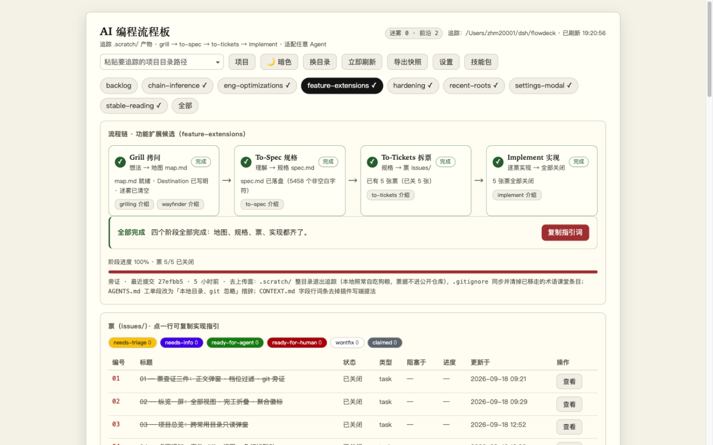
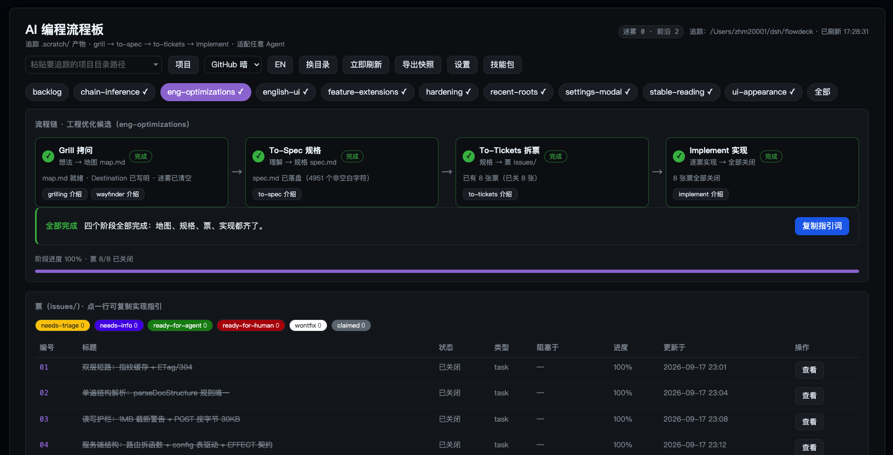
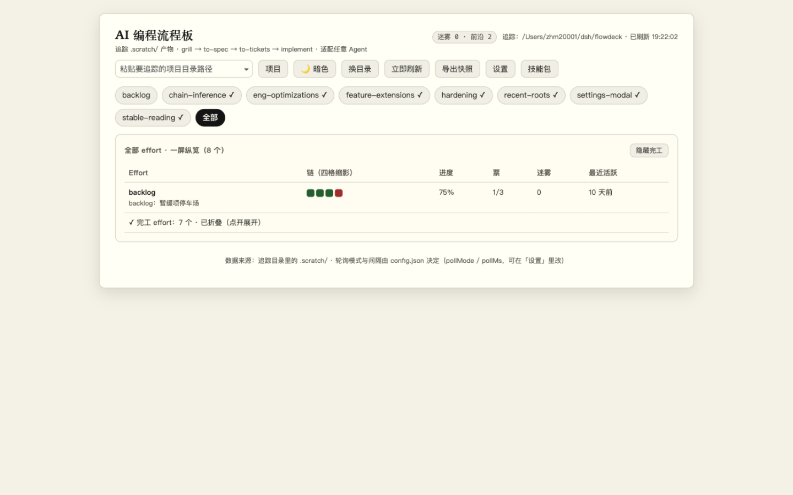

# Matt Skills Flowdeck —— mattpocock/skills 的可视化追踪面板

[English](README.md) · 简体中文

## 这是什么

**Matt Skills Flowdeck**（简称 **flowdeck**，下文同）是 [Matt Pocock 技能包](https://github.com/mattpocock/skills)（`grill → to-spec → to-tickets → implement` 的 AI 编程工作流）的**非官方可视化追踪面板**：你只要跑过这套技能，flowdeck 就会持续读取它产出的 `.scratch/` 产物，在一个本地网页上呈现每个 effort 走到了四阶段中的哪一格、当前阶段的下一步指引词、每张票的状态 / 类型 / 阻塞 / 进度。

还没用 mattpocock/skills？先从装它开始——没有这些产物，面板无从追踪。

技术上它是一个**零依赖**的本地 Node 服务（只用 Node 内置模块）+ 一个浏览器单页界面，不绑定任何编辑器或插件。

**本仓库是自包含的**：整个目录拷到任何地方（拷进目标项目、拷到别的机器都行）就能跑，不需要其他文件。追踪哪个目录写在 `config.json` 里，也可以在网页右上角随时换。

**它对 Agent 没有任何要求**：Claude Code、Cursor、或者你自己手写文件都行。流程板是被动追踪——任何 Agent 只要按下面的约定把产物写进 `.scratch/`，打开浏览器就能看到：

- `grill → to-spec → to-tickets → implement` 四个阶段各自走到了哪一步（完成 / 当前 / 待命）；
- 当前阶段的「下一步」指引词，点一下即复制，粘给任意 Agent 就能接着干；指引卡旁还能一键打开对应技能（grilling / wayfinder / to-spec / to-tickets / implement）的介绍；
- 每张票的状态、类型、阻塞关系、进度，点一行即复制那张票的实现指引，点「查看」弹窗读票全文（含 Comments）；
- 顶栏「导出快照」把最近一拍盘点原样落成带时间戳的 JSON 文件（存档或喂给别的 Agent）——快照是**盘点存档**，不含票正文（票正文点开才取，快照不是全文备档）；
- 设置里可开「桌面通知」（默认关）：票关闭、迷雾增减、阶段推进弹通知，回前台时积压聚合成一条；挂后台也知道进展。

界面默认中文，右上角「中/英」按钮整页切到英文（选择记在本浏览器；浏览器偏好英文的话首屏就是英文），技能包介绍也中英各一套；被追踪文件里起判据作用的部分（`## Destination` 等标题、Status 字段值）本来就是英文，产物正文用什么语言都不影响判定。

## 界面一览

下面是中文态的三张实拍（英文态的三张在 [英文 README](README.md#screenshots)，图存 `docs/screenshots-en/`）。

主视图（纸感亮色）——流程链四格、下一步指引卡、票表：



| 暗色主题 | 全部 effort 纵览 |
|---|---|
|  |  |

## 快速开始

```bash
git clone https://github.com/zhm20001/matt-skills-flowdeck.git flowdeck    # 也可以不走 git：直接把整个目录拷进目标项目
cd flowdeck
cp config.example.json config.json # 可选：要预配置就拷一份模板改（不拷也能跑，见下节）
npm start                          # 或者 node server.mjs
```

启动后打开终端打印的地址（默认 `http://127.0.0.1:3210`）。服务只监听本机回环地址，不对外网开放。写防护有两层：POST 接口要求自定义 `X-FlowDeck` 头（浏览器里别的网页发不出，挡跨站写）；回环监听时还校验请求的 Host 头，只认 `127.0.0.1` / `localhost` / `[::1]`——不校验的话，恶意页面把它的域名 DNS rebinding 到 127.0.0.1 后请求即同源，自定义头形同虚设，就能改追踪目录、读任意目录的 `.scratch` 内容。想局域网访问改 config.json 的 host（如 `0.0.0.0`）：此时 Host 校验自动放宽，局域网内任何机器都能访问、换目录、读被追踪目录的内容——建议同时设一个 `token`（见下节），给 `/api/*` 加一道共享令牌鉴权。

追踪目录不写死也行：启动时带 `--root /path/to/项目`，或者启动后在网页右上角的输入框里粘贴目录点「换目录」——立即生效并自动写回 config.json，下次启动不用再填。

网页上成功切换过的目录会自动进入「常用目录」列表（存在 config.json 的 `recentRoots` 里，最近使用在前）：点输入框或右缘的 ▾ 展开下拉，点一条立即切回；输入时按全路径过滤，↑↓/Enter 全键盘操作，每条 ✕ 即删。换浏览器、换机器拷贝目录，列表都跟着 config.json 走。

## config.json（追踪目录等配置都在这里）

起步两种方式任选：`cp config.example.json config.json` 然后改字段（模板结构与字段说明同款，值全是安全默认）；或者**完全不建这个文件**——服务容忍缺失，全部字段用默认值（root = 启动时当前目录、port 3210、host 127.0.0.1、pollMs 5000、recentRoots 空、token 空），网页上第一次换目录时会自动生成它。

改这些字段有两条路：直接手改文件，或用网页右上角的**「设置」弹窗**（root / recentRoots 除外——它们在顶栏有专门交互）。弹窗里改 pollMs 与访问令牌保存即生效（服务端每拍现读、令牌热切换），host / port 写盘后重启生效（toast 会分开提示）；两边永远是同一个文件，不会有第二真相。

config.json 被 git 忽略（`.gitignore`）：它会被服务在运行时改写，追踪它会让工作树永远不干净、本机绝对路径随 diff 外泄。入库的只有模板 `config.example.json`。

```json
{
  "root": "",            // 要追踪的项目目录（里面得有 .scratch/）。空 = 追踪启动时的当前目录
  "recentRoots": [],     // 常用目录：网页上切换过的目录自动收录（最近使用在前，上限 50）；也可手改
  "port": 3210,          // 网页端口，被占自动往后试 10 个；改完要重启
  "host": "127.0.0.1",   // 监听地址
  "pollMs": 5000,        // 网页轮询间隔毫秒，建议不低于 1000
  "token": ""            // 访问令牌：非空则 /api/* 全部要求携带；0.0.0.0 局域网暴露场景用
}
```

- 文件里另有一个「说明」键和「字段说明」键，是给人看的注释（JSON 不支持注释，就用了这两个字段），改配置时把值改掉即可，删掉也不影响运行；
- `root` 建议写**绝对路径**；写相对路径时按 config.json 所在目录解析；`~/` 开头会自动展开成用户主目录；
- `recentRoots` 里是归一化的绝对路径，`~/` 和相对路径的手写条目读入时自动归一、同一目录只算一条；`--root` 启动的临时目录不收录；
- 命令行参数（`--root/--port/--host/--config/--token`）优先级高于 config.json；
- **访问令牌（token）**：留空 = 不启用（默认，本机回环用法不需要）；设成非空字符串后，所有 `/api/*` 请求（数据盘点 + 换目录 + 删常用目录 + 改配置）都要带令牌——`X-FlowDeck-Token` 头或 URL `?token=值` 均可，比较用常数时间比对。打开页面时地址带上 `?token=你的令牌`，界面会自动记住（localStorage）并随之后每次请求携带，同时把地址栏里的令牌抹掉；界面静态壳（HTML/CSS）不设防——数据只在 `/api/*` 里。网页「设置」里改令牌**即时生效**（令牌只写不读，不回显，改完界面自动换用新令牌）；手改文件仍需重启；
- 在网页上换目录、删常用目录、改设置 = 服务写回这个文件，所以手改和网页改永远一致，不会有第二真相。

## 技能包全景介绍（docs/skill-intros/）

网页右上角的**「技能包」按钮**会弹出一扇静态展示窗：Matt 技能包 35 个技能的分类清单与逐个介绍（是什么、什么时候用、怎么触发，末尾附原文描述）。素材是仓库里手写的 Markdown——`docs/skill-intros/` 下每个技能一篇，`docs/skill-intros/README.md` 是全景总览；服务端 `GET /api/skills` 出清单（读各篇 frontmatter，按分类排序）、`GET /api/skills/<名字>` 取单篇原文，界面内置的极简渲染器负责显示，文档改了刷新即生效。技能包源码不在本仓库，这里只收录介绍。

界面切到英文时，这两条端点带上 `?lang=en`，改读 `docs/skill-intros-en/` 下的同名镜像篇（36 篇，一篇对一篇）。清单骨架——有哪些篇、哪一类、什么顺序、是否开发中——永远以中文目录为准，镜像只供标题、简介与正文；某篇缺镜像就仍显示中文，实际所服务的语言随 `X-FlowDeck-Doc-Lang` 响应头自报，界面据头在正文上方标注「此篇暂无英文」。不带 `lang`（或带除 `en` 外的任何值）时，两条端点的应答体与从前逐字节一致——这条逐字节红线钉的是成功体；JSON 错误应答另带稳定的 `code` 字段（有意为之，界面按 code 措辞）。

## 它读什么文件（`.scratch/` 产物约定）

一个 effort（一项工作）= `.scratch/<特性名>/` 目录，里面有下面三类产物中的一类或多类：

| 产物 | 路径 | 说明 |
|---|---|---|
| 地图 | `.scratch/<特性名>/map.md` | grilling / wayfinder 的产物；`## Destination` 是终点，`## Not yet specified` 里是「迷雾」（未定项） |
| 规格 | `.scratch/<特性名>/spec.md` | to-spec 的产物；流程板负责渲染与追踪 |
| 票 | `.scratch/<特性名>/issues/<两位编号>-<短名>.md` | to-tickets 的产物，一张票一个文件 |

票文件用行内字段（不是 YAML frontmatter）。字段行**加粗或裸写皆合法、语义相同**（to-tickets 模板发加粗，约定文档发裸写）：

```markdown
# 票标题
**Status:** ready-for-agent  # resolved / completed / closed / done 都算已关闭；claimed = 认领中
Type: task                   # research / prototype / grilling / task
**Blocked by:** #02, #03     # 依赖的其他票

## 进度：50%
```

形似字段行但读不懂的行（如 `*Status:* done`、列表项里的字段行）、Status 行多行冲突，会在界面票标题旁标 "!"（悬停看原文）；只提示写法漂移，不代表票无效。

`.scratch/` 根目录自己如果直接放了 `map.md` / `spec.md` / `issues/`，也算一个 effort（界面上叫「根 .scratch/」）。

## 流程链规则（可视化怎么判「走到哪了」）

四个阶段全部由**文件事实**推导，没有隐藏状态；每次刷新都是对磁盘的重新盘点：

| 阶段 | 完成判据 | 当前步时界面上会提示的下一步 |
|---|---|---|
| Grill 拷问 | map.md 存在、Destination 非空、迷雾条数为 0；或任一更晚阶段已有产物（推定完成，标「推定 · 无 map」） | 运行 grilling / wayfinder；或继续拷问清空迷雾 |
| To-Spec 规格 | spec.md 存在且有内容；已有票也推定完成（标「推定 · 无 spec」） | 运行 to-spec，把理解沉淀为 spec.md |
| To-Tickets 拆票 | issues/ 里至少有一张合法票 | 运行 to-tickets，把 spec 拆成票 |
| Implement 实现 | 至少一张票，且全部已关闭 | 从 Blocked by 为空的票开始逐张实现，完成后把 Status 改为 resolved |

第一个没完成的阶段就是「当前步」；四格全绿即 100%。

完成可以由下游**推定**：四个阶段是序贯的，更晚阶段已有产物就说明前面的路走过——哪怕没留本阶段的标准产物。grill-with-docs 把拷问共识收进 CONTEXT.md / ADR、不落 map.md，这类 effort 的 Grill 格由 spec.md 等下游产物推定完成，卡片上以「推定 · 无 map」标注与实证完成区分。推定与实证在链上地位相同（当前步后移、计入进度）；没有任何下游产物时早期行为不变（迷雾照常卡 Grill）。

## 怎么接入任意 Agent

流程板只认文件，所以接入方式就是让 Agent 遵守上面的产物约定。界面在没有任何产物时会给出两段可一键复制的起步指令：「工作约定」——整段贴进任意 Agent 的系统提示或对话开头即可；「建骨架指令」——让 Agent 在当前追踪目录下创建 `.scratch/<特性名>/map.md`（含 Destination 与 Not yet specified 两节），第一个 effort 就此起步：

```text
本项目的 AI 编程流程遵循 .scratch 产物约定，请严格照做：
1. 拷问（grilling）：结论写入 .scratch/<特性名>/map.md，必须含「## Destination」一节；还没定的事写进「## Not yet specified」。
2. 规格（to-spec）：把讨论沉淀为 .scratch/<特性名>/spec.md。
3. 拆票（to-tickets）：每张票一个文件，路径 .scratch/<特性名>/issues/<两位编号>-<短名>.md，
   正文含行内字段「Status:」（ready-for-agent / claimed / resolved）、「Type:」、「Blocked by: #编号」。
4. 实现（implement）：逐票实现；每完成一张票，就把该票文件里的 Status 行改为 resolved。
```

## 验证

```bash
npm run verify    # 等价别名：npm test
npm run lint      # 最小静态检查（ESLint，只兜真 bug 类漂移，不做风格执法）
```

verify 覆盖：effort 识别、四场景链状态（含后向推定与「推定 · 无 map」标注）、票字段解析、字段行格式（加粗与裸写等价、"!" 漂移警告）、纯函数幂等（流程链推导、常用目录 MRU 变换）、resolveRoot 解析规则、标题规则单一真相（map/spec 与票同走自带解析器）、HTTP 路由、端口被占自动换号、config.json 读写、换目录 API 的三种拒绝与热切换、设置端点扩字段（pollMs/host/port/token 逐字段校验、applied 生效语义、令牌热切换且响应不回显）、票原文端点 `/api/issue`（正常 / 404 / 令牌与防护）、盘点新字段（票 status 原值、git 旁证有/无——正路径用临时 git 仓库夹具、git 缺席自动跳过，Labels 仍不投影）、git 旁证不随指纹走（提交不动文件也能在 TTL 内追上）、前沿口径（依赖全结不计阻塞、闭环/幽灵依赖双双阻塞、open 未认领即前沿）、项目总览端点（混合好坏目录夹具、单坏不拖垮、GET 不碰排序、空清单单行）、Host 头校验（伪造 Host 403、本机写法放行）、超限 POST 的 413 应答、客户端中断不崩、坏配置告警恰好一次、CLI 参数防护、访问令牌（无/错令牌 401、头与查询串皆可、写操作同设防、静态壳不设防）、常用目录的收录/移顶/上限淘汰/`--root` 不收录、删除端点的防护与幂等，以及用 jsdom（开发依赖，没装则自动跳过该组）把界面真跑一遍——含常用目录下拉的展开、过滤、键盘操作、点选切换、✕ 删除与轮询共存，令牌从 URL 收下、记忆、随请求携带，渲染器三扩展（表格/围栏代码块/斜体与降级路径）、主区刷新的签名跳过与滚动恢复、规格卡片轻渲染与「展开阅读」弹窗（快照语义、Esc/焦点归还）、票正文弹窗（懒加载、快照语义、字段行剥除）、档位 chip 过滤（过滤/取消/轮询保持/键盘可达）、git 旁证行渲染与缺席消失、全部视图两组排序与折叠/开关的 localStorage 记忆（写入 + 预置读取）、徽标计数与前沿面板跳转、项目总览弹窗（按需单拍、坏行标注、点行触发现有切换流），及设置弹窗（初值、只提交变更字段、令牌同步与清除二次确认）、通知事件推导（单测：四类事件各成人话——含阶段回落与完成的边界、无变化 / 仅 mtime / effort 消失 / 换目录 / 新票出现零误报、次序确定）、桌面通知 jsdom（stub Notification：开关开启即申请、被拒回落带补救提示、回前台积压聚合一条「期间 N 项变化」、仅 mtime 零通知、定时拍逐条文案、点击聚焦并切到涉及 effort、用户主动拍与惰性档零通知）、导出快照（文件名 `flowdeck-snapshot-<项目名>-<本地时间>.json` 形状、内容为最近一拍盘点的原始响应体原样——不重新序列化、对象 URL 用完释放）、建骨架指令（空态页第二段：map.md 相对路径 + Destination/Not yet specified 两节 + 预期盘点变化，两段一键复制互不串台）、技能联动（链格技能入口打开技能包弹窗即定位该篇、已开窗换篇不重拉清单、不误触链格复制），以及界面语言层（初始语言按浏览器语言判定、判不中默认中文，切换即时重渲染且记忆在本浏览器，英文态逐视图扫不到中文，指引词/桌面通知/报错措辞都随语言，两条技能端点认 `?lang=en` 且不带参数的响应逐字节不变，36 篇英文镜像逐篇与中文原篇对齐，静态壳四条取词通道钉「取得到词」——空白标签骗不过零残留断言）。

推送即验证：`.github/workflows/ci.yml` 在 push/PR 时于 Node 18 与 22 两个版本跑 `npm run lint` + `npm run verify`。

## 文件清单

| 文件 | 职责 |
|---|---|
| `config.json` | 用户配置：追踪目录、常用目录、端口、监听地址、轮询间隔、访问令牌（含给人看的说明字段）。运行时被服务改写，git 忽略，本机路径不随 diff 外泄 |
| `config.example.json` | config.json 的入库模板：结构同款、值全是安全默认，无任何本机路径 |
| `flowchain.mjs` | 流程链推导（纯函数、零依赖；阶段定义旁硬编码各阶段的对应技能名，指引卡技能联动用；可独立搬运，不改任何调用方） |
| `notify.mjs` | 盘点事件推导（纯函数，只引 flowchain.mjs 的阶段表）：前后两拍盘点的结构化 diff——票开关、迷雾数、链当前步、新 effort 各成人话事件，桌面通知的消费输入（index.html 有 ES5 镜像，两处注释互指钉住） |
| `lib/parse.mjs` | 自带解析器（零依赖单遍结构解析，行为由 verify 夹具断言钉住） |
| `scan.mjs` | 扫描追踪目录的 `.scratch/`，产出盘点数据（热路径并行盘点，标题与票同走自带解析器） |
| `server.mjs` | HTTP 服务 + 命令行入口（`/`、`/tokens-*.css`、`/api/state`（含 `recentRoots` 与运行时 pollMs/host/port/tokenEnabled、随载荷下发的 `stageNames` 四阶段名表（中英两列，flowchain.mjs 单一表的直通车）、每 effort 一条 git 旁证字段——最近提交或 null，~15 秒 TTL、不随指纹走）、`/api/health`、`/api/roots-overview` 项目总览（常用目录逐个只读盘点，按需单拍不进轮询、GET 不触碰排序）、`/api/issue` 单张票 Markdown 原文（懒加载，1MB 护栏同款）、`/api/skills` 技能介绍清单、`/api/skills/<名字>` 单篇原文（两条都认 `?lang=en`，改读 `docs/skill-intros-en/` 的同名镜像；不带参数响应体逐字节不变，单篇以 `X-FlowDeck-Doc-Lang` 头自报所服务的语言）、`POST /api/config` 换目录与改 pollMs/host/port/token（逐字段校验，令牌改动即时生效）、`POST /api/recent-roots` 删常用目录；请求先过 Host 校验防 DNS rebinding，POST 端点另有 X-FlowDeck 头防跨站写、超限应答 413；token 非空时 `/api/*` 要求访问令牌；轮询路径全异步 IO） |
| `eslint.config.mjs` | 最小 lint 配置（ESLint flat config，只兜真 bug 类漂移；lib/parse.mjs 豁免——行为由 verify 夹具钉住） |
| `.github/workflows/ci.yml` | CI：push/PR 时 Node 18/22 跑 lint + verify |
| `tokens-paper.css` | 「纸感信纸风」设计 tokens 的唯一权威；色值/字体栈只允许出现在 tokens 文件里 |
| `tokens-github-dark.css` | 暗色主题 tokens：在 `data-theme="dark"` 下覆写同名 token，业务样式零改动整体换肤 |
| `index.html` | 浏览器界面（单文件、无构建；轮询间隔读 config.json，数据签名没变就不重画主区、真重画时恢复滚动位置，长文档读得下去；规格卡片 Markdown 轻渲染，「展开阅读」进全宽弹窗，票表「查看」复用同一弹窗懒加载票原文、六档 triage chip 过滤、git 旁证行；切换条尾「全部」视图一屏纵览（进行中按最近活跃在前、完工默认折叠，偏好记本浏览器）、顶栏「迷雾总数 + 前沿票数」徽标点开前沿票清单直达所属 effort；「项目」按钮开跨常用目录只读总览、点行即切；「导出快照」把最近一拍 /api/state 的原始响应体原样落下载文件（`flowdeck-snapshot-<项目名>-<本地时间>.json`，不重新序列化）；桌面通知（默认关，设置里开启即申请权限、被拒回落提示；回前台积压聚合一条、通知点击切到涉及 effort，偏好只存本浏览器）；空态页「工作约定」旁有「建骨架指令」一键复制；链格旁技能入口打开技能包弹窗定位该篇；可在线换追踪目录，地址栏带常用目录下拉；右上角「设置」弹窗集中改 pollMs/host/port/令牌，可切换纸感亮色 ⇄ GitHub 暗色，选择记忆在本浏览器，「技能包」按钮弹出静态全景介绍；顶栏「中/英」按钮整页换界面语言（文案、指引词、通知、报错措辞与技能介绍一起翻，选择记在本浏览器）；业务样式只消费一层 `--fd-*` 别名） |
| `docs/skill-intros/` | Matt 技能包全景介绍：每技能一篇中文提炼（frontmatter 供 `/api/skills` 出清单），README 是总览；网页弹窗的静态素材，也是清单骨架（有哪些篇、分类、顺序）的唯一真相 |
| `docs/skill-intros-en/` | 上述介绍的英文镜像：篇名一一对应，只译标题/简介/正文，`/api/skills*` 带 `?lang=en` 时读它 |
| `docs/screenshots/` | 本 README 用的中文态演示截图（亮色 / 暗色 / 全部纵览） |
| `docs/screenshots-en/` | 英文 README 用的英文态演示截图（同三张视角、同 1440×900） |
| `verify-standalone.mjs` | 独立验证脚本 |

## 现在没做的（有意留白）

- 不写 `.scratch` 里的文件：流程板对被追踪项目只读（唯一的写是改自己的 config.json），评论、关票等写回仍由 Agent 直接改文件；
- 不读 Git 历史（作为判据）：Implement 证据只认票 Status 行；git 只读信息仅作展示旁证——每张 effort 卡片底部的「最近提交」一行（短哈希 · 相对时间 · 标题，服务端 ~15 秒缓存；无 git 仓库、git 不可用或查询失败时整行消失，不报错不占位，也不影响链推导的任何判据）；
- 单追踪目录：一个服务追一个项目；要追多个就多起几个实例（`--config` 给每个实例一份自己的配置，端口错开）。
